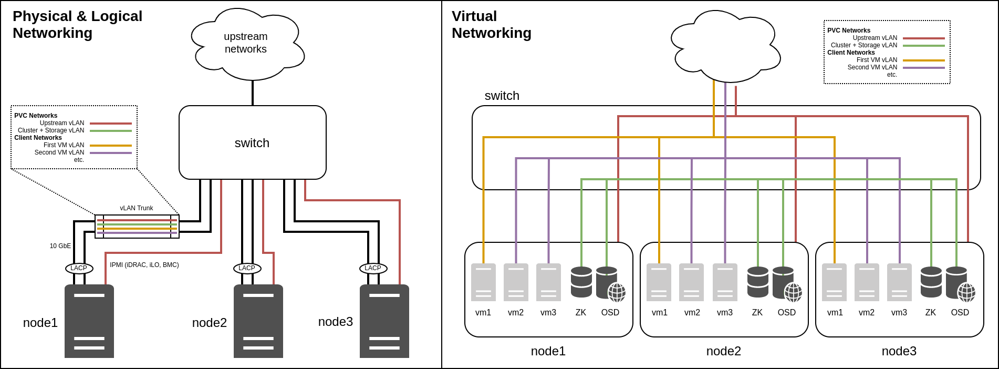
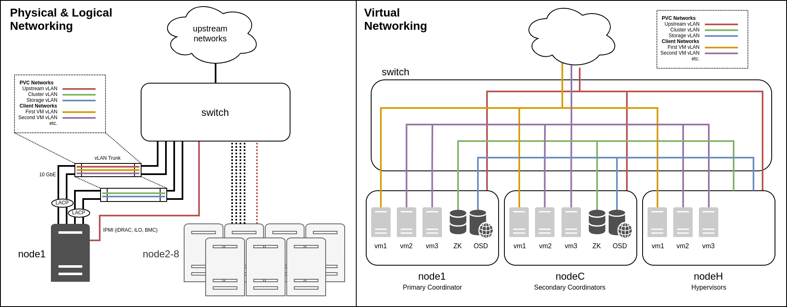
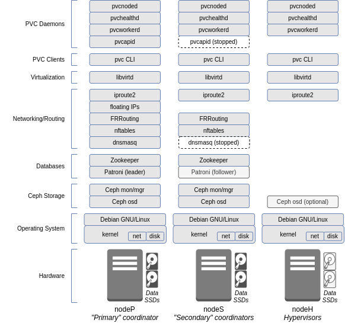

This document details the general architecture of a PVC cluster, including its main components, how the interoperate, how nodes are laid out, and the networks required by a cluster. This document must be read and understood to properly administrate a PVC cluster.

[TOC]

## Operating System

PVC is designed to run on top of Debian GNU/Linux, of any version since Debian 10.x "Buster". This is the operating system installed by the [PVC Node installer](https://github.com/parallelvirtualcluster/pvc-installer) and expected by the [PVC Ansible deployment playbooks](https://github.com/parallelvirtualcluster/pvc-ansible). No other operating systems, including derivatives of Debian, are supported by PVC.

At this time, only the `amd64` (`x86_64`) architecture is supported by PVC, though this may change in future versions.

PVC requires Python 3, at least version 3.7. It is designed to operate using the system Python3 packages of the supported Debian releases, and does not require a virtualenv, PIP, or other similar tools.

## PVC Terminology

PVC uses several terms throughout that are important to define.

* cluster: A PVC "cluster" is a collection of PVC "nodes" that function together in a redundant configuration. Management is done against a cluster, and resources allocated, assigned, and run on the cluster as a whole.

* node: PVC clusters consist of several "nodes", which are physical server computers running the PVC system daemons.

* virtual machine/VM: A guest operating system running inside of the KVM hypervisor on top of a PVC cluster. VMs are assigned to individual nodes, but can float across the various nodes in the cluster using live-migration (if supported by the VM configuration).

* OSD: PVC clusters allocate storage for virtual machines from a set of special disks called "OSDs"; this term is borrowed from the terminology of the underlying Ceph storage subsystem.

* pool: Storage in the PVC cluster is allocated to "pools", which reside on a set of OSDs using a given replication profile.

* volume: Individual storage "volumes" for VMs are allocated to storage pools.

* network: PVC makes use of several different networks (vLANs or VXLANs) of different classes.

## Cluster Layout

The following diagrams show both a 3-node cluster and an 8-node cluster for comparison, along with how their networks (detailed below) are laid out both physically and logically. These diagrams can be referenced during the following sections to understand the layout of the cluster.

## Software Stack

The software stack of a PVC node consists of several daemons as well as the core operating system, and can be represented by the following diagram:

The 3 classes of node roles are shown, as will be discussed below.

## Node Roles

### Coordinator

Coordinators are nodes which contain the various databases and core daemons which cannot be scaled indefinitely across the entire cluster. This includes the Zookeeper database instances, Patroni database instances, FRRouting instances, and the PVC API and provisioner worker.

Coordinators are decided at deploy time, and the number of coordinators as well as their network addresses cannot be changed at runtime without extensive downtime and reconfiguration. Thus extreme care must be taken to choose the optimal coordinator configuration and network layout when deploying the cluster.

A normal cluster will contain either 3 or 5 coordinators, depending on its size. For clusters of between 3 and 12 nodes, 3 coordinators is generally sufficient; for larger clusters, 5 coordinators may provide additional resiliency as two (2) could then be brought down for maintenance instead of just one (1) while still retaining quorum.

### Primary Coordinator

The primary coordinator takes on some additional, special functionality from the other coordinators during runtime. This includes the active instance of the PVC API and provisioner worker, dnsmasq to provide managed network services, the Patroni leader, and some PVC-internal services for statistics collection.

Only a single coordinator is primary at any given time, and the primary coordinator is selected from the available coordinators at runtime via either automatic selection (contention) or administrator intervention.

The primary coordinator transitions between coordinators via a lockstep migration process taking approximately 5-10 seconds, during which some of the provided services are unavailable, including the API. During this transition, the special "takeover" and "relinquish" states are used.

### Hypervisor

Any PVC node that is not a coordinator is a hypervisor. Hypervisors do not run any of the indicated services, and are used exclusively for VM compute and, optionally, OSD storage disks.

All nodes added to a cluster beyond the initial coordinators must be added as hypervisors.

## Quorum and Node Loss

Many PVC daemons, as discussed below, leverage a majority quorum to function. A majority quorum requires an *absolute* majority - that is, 2-of-3 or 3-of-5 - nodes to function; any less, and cluster will become inoperable. For this reason, there must always be an odd number of coordinators.

This is an important consideration when deciding the number of coordinators to allocate: a 3-coordinator system can tolerate the loss of a single coordinator without impacting the cluster, but losing 2 would render the cluster inoperable; similarly, a 5-coordinator system can tolerate the loss of 2 coordinators, but losing 3 would render the cluster inoperable. In addition, these coordinators must be located in such a way that a majority can communicate in outage events, in order for the cluster to remain operational. This affects the network and physical design of a cluster and must be carefully considered during deployment; for instance, network switches and links, and power, should be redundant.

For more details on this, see the [Fencing](/architecture/fencing.) and [Georedundancy](/architecture/georedundancy.md) documentation. The first also covers the node fencing process, which allows automatic recovery from a node failure in certain outage events.

Hypervisors are not affected by the coordinator quorum: a cluster can lose any number of non-coordinator hypervisors without impacting core services, though compute resources (CPU and memory) must be available on the remaining nodes for VMs to function properly, and any OSDs on these hypervisors, if applicable, would become unavailable, potentially impacting storage availability.

## Databases

### Zookeeper

PVC uses Zookeeper for its state database. Zookeeper provides a multi-master, always-consistent key-value store, which PVC uses to store data about its operation, configuration, and state.

The Zookeeper database runs on the coordinator nodes, and requires a majority quorum (2-of-3, 3-of-5, etc.) of coordinators to function properly.

### Patroni/PostgreSQL

PVC uses the Patroni PostgreSQL cluster manager to store relational data for use by the [Provisioner subsystem](/manuals/provisioner.md) and managed network DNS aggregation.

The Patroni system runs on the coordinator nodes, with the primary coordinator taking on the "leader" role (read-write) and all others taking on the "follower" role (read-only). Patroni leverages Zookeeper to handle state, and is thus dependent on Zookeeper to function.

## Cluster Storage

PVC leverages a "hyperconverged" storage subsystem, whereby the storage backend (Ceph) runs on the same systems as the VMs themselves, providing a fully colocated storage and compute solution in one set of physical servers. 

The core Ceph daemons run on the coordinator nodes, and this includes the Monitor (used to direct clients to OSDs), Manager (used to monitor the Ceph cluster), and OSDs. Additional OSDs can also be added to non-coordinator hypervisor nodes. Like other aspects of the cluster, this system uses quorum and thus requires a majority quorum (2-of-3, 3-of-5, etc.) of coordinators to function properly.

PVC leverages Ceph's Rados Block Device (RBD) interface, which provides virtual block devices similar to Linux LVM or ZFS zvols. These virtual block devices are then mapped to VMs to provide VM disks.

The Ceph storage system features multiple layers. First, OSDs are created on dedicated physical disks (SSDs) on each hypervisor; at least 3 total OSDs, spread evenly across 3 nodes, is recommended for full redundancy. Next, a Pool is created on top of the OSDs, which defines a number of Placement Groups (PGs) which divide data between OSDs, as well as a replication strategy (a total number of copies of each block of data, and a minimum number of blocks for a write to be considered a success). Finally, Volumes (RBD volumes) are created on top of the pool to provide the virtual block devices; a Volume is fixed to a particular Pool.

This default layout provides several benefits, including multi-node replication, the ability to tolerate the loss of a full node without impacting storage, and shared storage facilitating live migration, at the cost of a 3x storage penalty. Additional replication modes (for instance, more copies) are possible to provide more resiliency at the cost of a larger storage penalty.

It can be important to more advanced configurations to understand how disk writes work in this system to properly understand the implications of this replication. Please see the [Ceph Write Process](/manuals/ceph-write-process.md) documentation for a full explanation.

## Cluster Networking

### Core Networks

PVC requires a number of core networks, which are required independent of any client networks (see below) for the cluster to function correctly. These networks are configured at cluster deploy time, and cannot be easily changed later.

Within each core network, each node is assigned a static IP address; DHCP is not supported. This address must be defined in the `pvcnoded.yaml` file of each node, and the core networks are brought up by the PVC node daemon, not by the operating system. The daemon includes a feature to auto-select the node IP address from the network via its node ID (so that node 1 would receive .1, etc.) which requires at least a `/24` subnet to function.

In addition to the main static IP of each node, there is also a "floating" IP in each network which is bound to the primary coordinator. This IP can be used as a single point of access into the cluster for the API or other services that need to see the "cluster as a whole" rather than individual nodes.

Some or all of these networks can be collapsed, though for optimal performance and security, it is recommended that, at a minimum, the "upstream" and "cluster"/"storage" networks be separated. The physical aspect is discussed further in the [Hardware Requirements](/architecture/hardware-requirements.md) documentation, however larger clusters should generally lean towards splitting these networks into separate physical, as well as logical, links.

#### Upstream

The "upstream" network provides outside connectivity to and from the PVC cluster. It is the network which should contain the default gateway, and through which the cluster can be managed via the API and SSH and through which upstream routing to and from managed client networks (see below) will occur.

The "upstream" network requires outbound Internet access, as it will be used to fetch updates and install software.

This network, though it requires Internet access, should not be exposed directly to the Internet or to other untrusted local networks for security reasons. PVC itself makes no attempt to hinder access to nodes from within this network. At a minimum, an upstream firewall should prevent external access to this network, and only trusted hosts or on-cluster VMs should be added to it.

In addition to all other functions, server IPMI interfaces should reside either directly in this network, or in a network directly reachable from this network, to provide fencing and auto-recovery functionality. For more details, see the [Fencing](/architecture/fencing.md) documentation.

#### Cluster

The "cluster" network provides inter-node connectivity within the PVC cluster, for all purposes except backend storage. Managed network VXLANs, VM migrations, database updates, and node heartbeats use this network.

The "cluster" network requires no outside routing, and is entirely local to the PVC cluster itself. A `/24` subnet of RFC1918 addresses should be used. This network should use the largest possible MTU on the underlying network hardware for optimal performance.

#### Storage

The "storage" network provides inter-node connectivity within the PVC cluster, for storage backend purposes. OSD replication, VM access to storage, and Ceph backend communications use this network.

The "storage" network requires no outside routing, and is entirely local to the PVC cluster itself. A `/24` subnet of RFC1918 addresses should be used. This network should use the largest possible MTU on the underlying network hardware for optimal performance.

For small clusters, a common configuration is to collocate the Storage and Cluster networks onto the same vLAN and IP space, in effect merging their functions. Note that this precludes separation of the networks onto different physical links in the future. Very high performance or large clusters should thus avoid this.

### Client Networks

In addition to the core networks, at least one or more client network should be created. Client networks are managed on a running cluster via the API, and can be changed dynamically (assuming VMs are reconfigured afterwards).

#### Managed

Managed client networks leverage the EBGP VXLAN subsystem to provide virtual layer 2 networks between VMs. These networks do not require any additional configuration on the underlying network hardware and are completely transparent to it, operating over the "cluster" core network.

PVC can provide services to clients in this network via the DNSMasq subsystem, including IPv4 and IPv6 routing, firewalling, DHCP, DNS, and NTP. An upstream router must be configured to accept and return traffic from these network(s), either via BGP or static routing, if outside access is required.

**NOTE:** Be aware of the potential for "tromboning" when routing between managed networks. All traffic to and from a managed network will flow out the primary coordinator. Thus, if there is a large amount of inter-network traffic between two managed networks, all this traffic will traverse the primary coordinator, introducing a potential bottleneck. To avoid this, keep the amount of inter-network routing between managed networks or between managed networks and the outside world to a minimum.

One major purpose of managed networks is to provide a bootstrapping mechanism for new VMs deployed using the [PVC provisioner](/manuals/provisioner.md) with CloudInit metadata services (see that documentation for details). Such deployments will require at least one managed network to provide access to the CloudInit metadata system.

#### Bridged

Bridged client networks leverage vLANs on the underlying network hardware to provide access to externally-managed networks inside VMs. These networks will require the necessarily vLAN(s) to be plumbed into all PVC cluster nodes as a trunk on the `bridge_device` interface configured in the `pvcnoded.yaml` configuration file.

Bridged networks provide more external flexibility than managed networks, and can handle far more network traffic, though at the cost of losing cluster-aware networking facilities.

Bridged networks are explicitly isolated on the hypervisors, so that traffic to and from them cannot interface with the PVC nodes unless explicitly (and manually, outside of PVC) configured to do so.

#### SR-IOV

SR-IOV provides two mechanisms for directly passing underlying network devices into VMs. On supported network interface cards (NICs), the SR-IOV subsystem can create multiple virtual interfaces ("VFs") from a single physical interface ("PF"), managed via PVC, which can then be passed into VMs using two methods, "macvtap" and "hostdev".

SR-IOV networks require static configuration of the hypervisor nodes, both to define the PFs and to define how many VFs can be created on each PF. These options are defined with the `sriov_device` and `vfcount` options in the `pvcnoded.yaml` configuration file.

**NOTE:** Changing the PF or VF configuration cannot be done dynamically, and requires a restart of the `pvcnoded` daemon.

**NOTE:** Some SR-IOV NICs, specifically Intel NICs, cannot have the `vfcount` modified during runtime after being set. The node must be rebooted for changes to be applied.

Once one or more PFs are configured, VFs can then be created on individual nodes via the PVC API, which can then be mapped to VMs in a 1-to-1 relationship.

**NOTE:** The administrator must be careful to ensure the allocated VFs and PFs are identical between all nodes, otherwise migration of VMs between nodes can result in incorrect network assignments.

Once VFs are created, they may be attached to VMs using one of the two strategies mentioned above. Each strategy has trade-offs, so careful consideration is required:

* `macvtap` bindings allow VMs to be live-migrated (assuming the required VF exists on the target node), but are less flexible: the vLAN of the VF must be configured in PVC and are limited to one vLAN per VF, and maximum performance can be impacted. `macvtap` is mostly useful for isolation of networks to a slightly higher degree than normal Bridged networks, rather than performance, though the hypervisor could still inspect and access traffic on the VF.

* `hostdev` bindings allow the maximum flexibility inside the guest, allowing very high performance and the configuration of an arbitrary number of vLANs on the VF from within the guest, but **the VM cannot be live-migrated** between nodes and must be shut down instead. They also provide the maximum isolation possible, with the VF not being visible in any way to the hypervisor (bi-directional isolation).

#### Direct Pass-through

Though not explicitly managed by PVC, it is also possible to use direct PCIe pass-through mechanisms in Libvirt to pass NICs (or other devices) into a guest. These must be configured manually, and have all the same benefits and caveats as the `hostdev` SR-IOV interface mentioned above.

