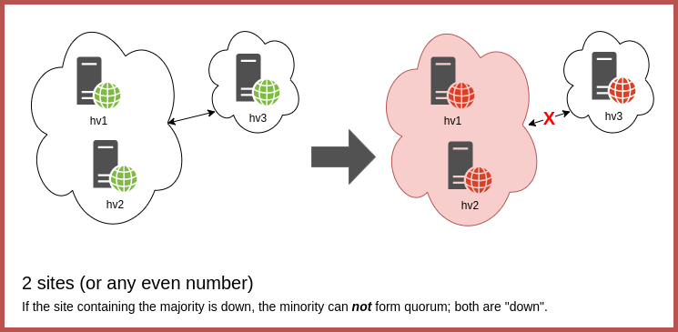
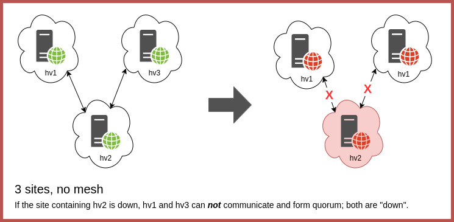
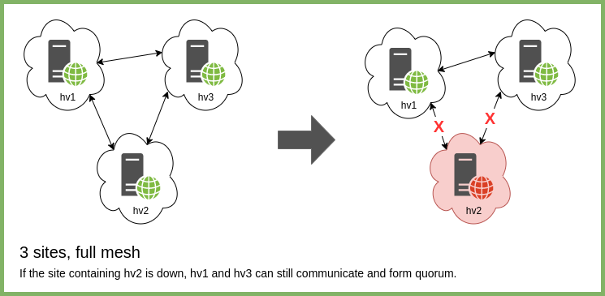
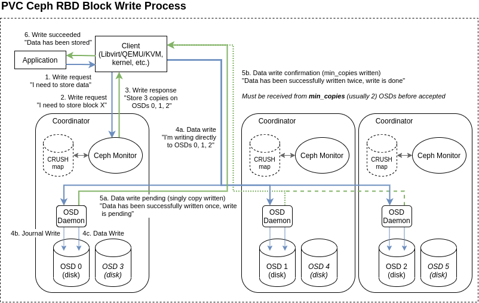

Georeundancy refers to the ability of a system to run across multiple physical geographic areas, and to help tolerate the loss of one of those areas due to a catastrophic event. With respect to PVC, there are two primary types of georedundancy: single-cluster georedundancy, which covers the distribution of the nodes of a single cluster across multiple locations; and multi-cluster georedundancy, in which individual clusters are created at multiple locations and communicate at a higher level. This page will outline the implementation, important caveats and potential solutions if possible, for both kinds of georeundancy.

[TOC]

## Single-Cluster Georedundancy

In a single-cluster georedundant design, one logical cluster can have its nodes, and specifically it's coordinator nodes, placed in different physical locations. This can help ensure that the cluster remains available even if one of the physical locations becomes unavailable, but it has multiple major caveats to consider.

### Number of Locations

Since the nodes in a PVC cluster require a majority quorum to function, there must be at least 3 sites, of which any 2 must be able to communicate directly with each other should the 3rd fail. A single coordinator (for a 3 node cluster) would then be placed at each site.

2 site georedundancy is functionally worthless within a single PVC cluster: if the primary site were to go down, the secondary site will not have enough coordinator nodes to form a majority quorum, and the entire cluster would fail.

In addition, a 3 site configuration configuration without a full mesh or ring, i.e. where a single site functions as an anchor between the other two, would be a point of failure and would render the cluster non-functional if offline.

Thus, the smallest useful georedundant physical design is 3 sites in full mesh or ring. The loss of any one site in this scenario will still allow the remaining nodes to form quorum and function.

A larger cluster could theoretically span 3 (as 2+2+1) or more sites, however with a maximum of 5 coordinators recommended, this many sites is likely to be overkill for the PVC solution; multi-cluster georedundancy would be a preferable solution for such a large distribution of nodes.

Since hypervisors are not affected by nor affect the quorum, any number can be placed at any site. Only compute resources would thus be affected should that site go offline. For instance, a design with one coordinator and one hypervisor at each site would provide a full 4 nodes of compute resources even if one site is offline.

### Fencing

PVC's [fencing mechanism](fencing.md) relies entirely on network access. First, network access is required for a node to update its keepalives to the other nodes via Zookeeper. Second, IPMI out-of-band connectivity is required for the remaining nodes to fence a dead node.

Georedundancy introduces significant complications to this process. First, it makes network cuts more likely, as the cut can now occur somewhere outside of the administrator's control (e.g. on a public utility pole, or in a provider's upstream network). Second, the nature of the cut means that without backup connectivity for the IPMI functionality, any fencing attempt would fail, thus preventing automatic recovery of VMs from the cut site onto the remaining sites. Thus, in this design, several normally-possible recovery situations become impossible to recover from automatically, up to and including any recovery at all. Situations where individual VM availability is paramount are therefore not ideally served by single-cluster georedundancy.

### Orphaned Site Availability

It is also important to note that network cut scenarios in this case will result in the outage of the orphaned site, even if it is otherwise functional. As the single node could no longer communicate with the majority of the storage cluster, its VMs will become unresponsive and blocked from I/O. Thus, splitting a single cluster between sites like this will **not** help ensure that the cut site remains available; on the contrary, the cut site will effectively be sacrificed to preserve the *remainder* of the cluster. For instance, office workers in that location would still not be able to access services on the cluster, even if those services happening to be running in the same physical location.

### Network Speed

PVC clusters are quite network-intensive, as outlined in the [hardware requirements](hardware-requirements.md#networking) documentation. This can pose problems with multi-site clusters with slower interconnects. At least 10Gbps is recommended between nodes, and this includes nodes in different physical locations. In addition, the traffic here is bursty and dependent on VM workloads, both in terms of storage and VM migration. Thus, the site interconnects must account for the speed required of a PVC cluster in addition to any other traffic.

### Network Latency & Distance

The storage write performance within PVC is heavily dependent on network latency. To explain why, one must understand the process behind writes within the Ceph storage subsystem:

As illustrated in this diagram, a write will only be accepted by the client once it has been successfully written to at least `min_copies` OSDs, as defined by the pool replication level (usually 2). Thus, the latency of network communications between any two nodes becomes a major factor in storage performance for writes, as the write cannot complete without at least 4x this latency (send, ack, receive, ack). Significant physical distances and thus latencies (more than about 3ms) begin to introduce performance degradation, and latencies above about 5-10ms can result in a significant drop in write performance.

To combat this, georedundant nodes should be as close as possible, ideally within 20-30km of each other at a maximum. Thus, a ring *within* a city would work well; a ring *between* cities would likely hamper performance significantly.

## Overall Conclusion: Avoid Single-Cluster Georedundancy

It is the opinion of the author that the caveats of single-cluster georedundancy outweigh the benefits in almost every case. The only situation for which multi-site georedundancy provides a notable benefit is in ensuring that copies of data are stored online at multiple locations, but this can also be achieved at higher layers as well. Thus, we strongly recommend against this solution for most use-cases.

## Multi-Cluster Georedundancy

Starting with PVC version 0.9.103, the system now supports online VM snapshot transfers between clusters. This can help enable a second georedundancy mode, leveraging a full cluster in two sites, between which important VMs replicate. In addition, this design can be used with higher-layer abstractions like service-level redundancy to ensure the optimal operation of services even if an entire cluster becomes unavailable. Service-level redundancy between two clusters is not addressed here.

Multi-cluster redundancy eliminates most of the caveats of single-cluster georedundancy while permitting single-instance VMs to be safely replicated for hot availability, but introduces several additional caveats regarding promotion of VMs between clusters that must be considered before and during failure events.

### No Failover Automation

Georedundancy with multiple clusters offers no automation within the PVC system for transitioning VMs like with single-cluster fencing and recovery. If a fault occurs necessitating promotion of services to the secondary cluster, this must be completed manually by the administrator. In addition, once the primary site recovers, it must be handled carefully to re-converge the clusters (see below).

### VM Automirrors

The VM automirror subsystem must be used for proper automatic redundancy on any single-instance VMs within the cluster. A "primary" side must be selected to run the service normally, while a "secondary" site receives regular mirror snapshots to update its local copy and be ready for promotion should this be necessary. Note that controlled cutovers (for e.g. maintenance events) do not present issues aside from brief VM downtime, as a final snapshot is sent during these operations.

The automirror schedule is very important to define here. Since automirrors are point-in-time snapshots, only data at the last sent snapshot will be available on the secondary cluster. Thus, extremely frequent automirrors, on the order of hours or even minutes, are recommended. In addition note that automirrors are run on a fixed schedule for all VMs in the cluster; it is not possible to designate some VMs to run more frequently at this time.

It is also recommended that the guest OSes of any VMs set for automirror support use atomic writes if possible, as online snapshots must be crash-consistent. Most modern operating and file systems are supported, but care must be taken when using e.g. in-memory caching of writes or other similar mechanisms to avoid data loss.

### Data Loss During Transitions

VM automirror snapshots are point-in-time; for a clean promotion without data loss, the `pvc vm mirror promote` command must be used. This affects both directions:

* When promoting a VM on the secondary after a catastrophic failure of the primary (i.e. one in which `pvc vm mirror promote` cannot be used), any data written to the primary side since the last snapshot will be lost. As mentioned above, this necessitates very frequent automirror snapshots to be viable, but even with frequent snapshots some amount of data loss will occur.

* Once the secondary is promoted to become the primary manually, both clusters will consider themselves primary for the VM, should the original primary cluster recover. At that time, there will be a split-brain between the two, and one side's changes must be discarded; there is no reconciliation possible on the PVC side between the two instances. Usually, recovery here will mean the removal of the original primary's copy of the VM and a re-synchronization from the former secondary (now primary) to the original primary cluster with `pvc vm mirror create`, followed by a graceful transition with `pvc vm mirror promote`. Note that the transition will also result in additional downtime for the VM.

## Overall Conclusion: Proceed with Caution

Ultimately the potential for data loss during unplanned promotions must be carefully weighed against the benefits of manually promoting the peer cluster. For short or transient outages, it is highly likely to result in more data loss and impact than is acceptable, and thus a manual promotion should only be considered in truly catastrophic situations. In such situations, the amount of acceptable data loss must inform the timing of the automirrors, and thus how frequently snapshots are taken and transmitted. Ultimately, service-level redundancy is advised when any data loss would be catastrophic.
